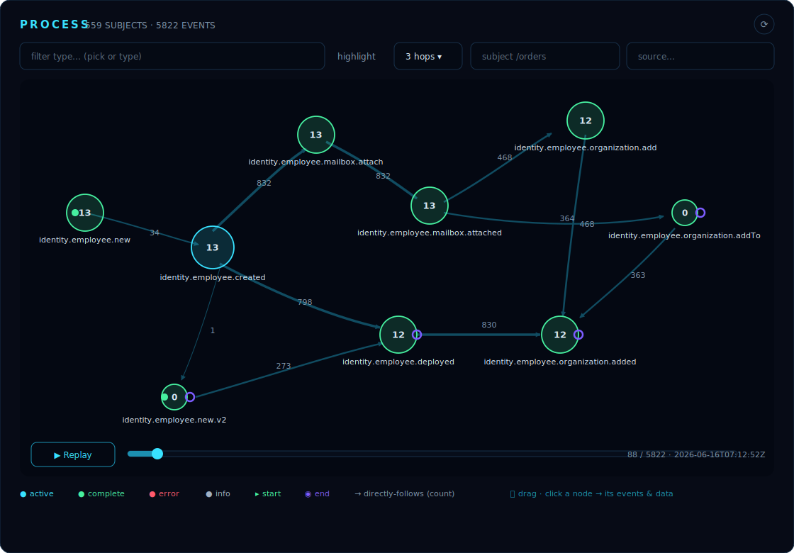

# Clio Workbench — Architektur- & Ideenpapier

**Status:** `KONZEPT` · **Version:** 0.2 · **Bezug:** [`pblumer/clio`](https://github.com/pblumer/clio)

> Ein Zeichenbrett für Event-Sourcing-Modelle. Die Workbench hilft
> Entwickler:innen, die Events einer Entität oder eines Prozesses zu *entwerfen*,
> bevor sie existieren — und macht aus dem Entwurf nutzbare Artefakte:
> Clio-Schemas und Dokumentation.



---

## 1. Motivation & Abgrenzung

Clio (`cliostore`) ist ein eigenständiger Event Store in Go: append-only,
CloudEvents-basiert, mit Hash-Kette, Signaturen, CEL-Abfragen und einem bereits
eingebetteten Betriebs-Dashboard unter `/ui`.

Das `/ui` ist ein **Betriebs- und Beobachtungswerkzeug** (Dashboard,
Live-Events, Explorer, Query, Erzeugen, Hilfe) — Vanilla JS, kein Build-Step,
ins Binary embedded (ADR-020). Es beantwortet *„Was passiert gerade in meiner
laufenden Instanz?"*.

Die **Workbench** beantwortet eine andere Frage — und zwar früher im
Entwicklungsfluss: *„Wie sehen die Events aus, mit denen ich meine Entität oder
meinen Prozess modelliere?"*. Sie ist ein **gestaltendes Entwicklertool**. Der
Entwickler zeichnet den Lebenszyklus, definiert die Event-Typen als Übergänge,
hängt Schemas an die Payloads — und exportiert das Ergebnis als
Schema-Registrierungen für Clio und als Dokumentation.

Der Unterschied zum letzten Entwurfsstand ist eine bewusste Umkehrung: Nicht
zuerst *aus realen Events ableiten*, sondern zuerst *entwerfen*. Der abgeleitete
(„entdeckte") Graph bleibt wertvoll, rückt aber an die zweite Stelle — als
Gegenprobe (Soll/Ist), nicht als Ausgangspunkt.

| | `/ui` (im Kern-Repo) | Workbench (dieses Papier) |
|---|---|---|
| Zielgruppe | Betrieb, „mal draufschauen" | Entwickler:innen beim Modellieren |
| Leitfrage | Was passiert jetzt? | Wie entwerfe ich meine Events? |
| Modus | beobachtend | gestaltend (Editor zuerst) |
| Kopplung | In-Tree, embedded (ADR-020) | Separates Binary gegen die HTTP-API |
| Frontend | Vanilla JS, kein Build-Step | Go-Templates + HTMX + Canvas-JS |
| Release | mit Clio | unabhängig |

Die Workbench ersetzt das `/ui` **nicht** und berührt ADR-020 nicht.

### 1.1 Die Workbench als Labor

Neben dem gestaltenden Entwurf hat die Workbench ein zweites, gleichrangiges
Ziel: Sie ist ein **Labor zum Erforschen von Event Sourcing**. Wer verstehen
will, wie sich ein Aggregat über die Zeit verhält, wie aus einzelnen Events ein
Prozess emergiert oder warum reale Abläufe vom gedachten Modell abweichen,
braucht Werkzeuge zum *Beobachten, Zerlegen und Durchspielen* echter
Event-Ströme — kein weiteres Betriebs-Dashboard, sondern eine Werkbank, an der
man Hypothesen über Event-Daten bilden und prüfen kann.

Konkret heißt das: Event-Daten sollen sich nicht nur statisch ansehen, sondern
**aktiv durchforschen** lassen — der entdeckte Prozess-Graph, der
Timeline-Replay, die Varianten und die Subject-Streams sind die ersten
Laborgeräte. Künftige Analyse-Funktionen (z.B. einzelne Subjects gezielt durch
den Graphen verfolgen, Streams solo abspielen, Pfade vergleichen) zahlen auf
genau dieses Ziel ein. Die Gegenprobe aus Abschnitt 7 ist der Spezialfall, bei
dem die Forschung einen konkreten Entwurf als Messlatte hat.

**Nebenläufigkeit statt Spaghetti.** Ein reiner Directly-Follows-Graph kann
*Parallelität* nicht ausdrücken: Laufen Aktivitäten nebenläufig, ist ihre
Reihenfolge zufällig, und jede beobachtete Verschachtelung wird zu einer eigenen
dünnen Kante und jede Umordnung zu einer eigenen „Variante" — ein dichtes Netz,
das mehr Varianten vortäuscht, als real existieren. Die Discovery erkennt solche
Paare über das Heuristics-Miner-Abhängigkeitsmaß (`internal/process`,
`detectConcurrency`: in **beiden** Richtungen gesehen, mit ausgewogener
Häufigkeit) und fasst sie zu **Nebenläufigkeits-Blöcken** zusammen. Der Effekt:
die Verschachtelungen eines Blocks fallen zu **einer** Variante zusammen, die
Block-internen Kanten weichen einem `∥`-Rahmen, und die parallelen Aktivitäten
teilen sich eine Spalte. (Erste Stufe: maximale Gruppen als
Zusammenhangskomponenten der `∥`-Relation; eine Verschärfung zu echten Cliquen
und ein BPMN-Parallel-Gateway sind die nächsten Schritte.)

---

## 2. Leitprinzipien

1. **Ein Binary, reines Go.** Alles — UI, Assets, Templates, Canvas-JS — über
   `embed.FS` ins Binary gebacken. Kein npm, keine Toolchain, kein CDN.
2. **Kein Build-Step im Frontend.** HTMX + `html/template` für die Werkbank,
   schlankes Vanilla-JS für das Zeichen-Canvas. Logik so weit wie möglich in Go.
3. **Nur die öffentliche API.** Ausschließlich dokumentierte HTTP-Endpunkte. Kein
   privilegierter Zugriff, keine Kopplung an Interna.
4. **Der Token bleibt serverseitig.** Bearer-Token wird vom Backend gehalten und
   durchgereicht, nie ins Browser-JS gelegt.
5. **Der Entwurf ist das Artefakt.** Das Modell ist die Quelle der Wahrheit;
   Schemas und Doku werden daraus *generiert*, nicht umgekehrt.
6. **Space-Look (als Default-Theme).** Visuell im selben Sci-Fi/HUD-Register wie
   Clios `/ui` (Sternenfeld, Neon-Glow) — gemeinsame Designsprache ohne
   Code-Kopplung. Der Look ist heute *ein wählbares Theme* (»Nebula«) über einem
   portablen Token-Vertrag; wem das Space-Feeling nicht liegt, wählt ein anderes
   (Aurora, Carbon, Swiss). Der Vertrag ist bewusst so gebaut, dass ihn auch
   Clios `/ui` übernehmen kann. Details: [`docs/THEMES.md`](THEMES.md).

---

## 3. Systemarchitektur

```
   Browser
     │  HTML-Fragmente (HTMX), Canvas-JS (Editor), SSE (optional, Gegenprobe)
     ▼
┌─────────────────────────────┐
│  clio-workbench  (:8080)     │
│                              │
│  ├─ embed.FS: Templates,     │
│  │   htmx.min.js, Canvas-JS, │
│  │   CSS (space look)        │
│  ├─ html/template Renderer   │
│  ├─ Modell-Store (Entwürfe)  │
│  ├─ Generatoren:             │
│  │   Modell → Clio-Schema    │
│  │   Modell → Doku/Diagramm  │
│  └─ ReverseProxy /api/*       │   ──Bearer──┐
│      (FlushInterval: -1)      │             │
└─────────────────────────────┘             ▼
                                     ┌──────────────────┐
                                     │  cliostore (:3000)│
                                     │  HTTP-API         │
                                     └──────────────────┘
```

### 3.1 Backend (Go)

- **Statisches UI** aus `embed.FS` ausliefern.
- **Modell-Store**: Die Entwürfe (Lebenszyklen, Event-Typen, Schemas) werden
  gehalten und persistiert — siehe offene Frage in Abschnitt 8.
- **Generatoren**: Aus einem Modell werden (a) `register-event-schema`-Aufrufe
  bzw. eine importierbare Schema-Sammlung und (b) Dokumentation + Diagramm-Export
  erzeugt. Das ist der Kern-Mehrwert und liegt bewusst in Go, nicht im Browser.
- **Reverse-Proxy** auf `/api/*` mit serverseitig injiziertem Token, um Schemas
  direkt in eine laufende Instanz zu pushen und (für die Gegenprobe) reale Events
  zu lesen. `FlushInterval: -1`, damit NDJSON-Streams nicht puffern.

### 3.2 Frontend

- **Zeichen-Canvas** (Vanilla JS, embedded): das Herzstück — Knoten und Kanten
  setzen, benennen, verbinden. Siehe Abschnitt 5.
- **HTMX** für die umgebende Werkbank: Eigenschafts-Panels, Schema-Editor pro
  Event-Typ, Modell-Liste, Export-Dialoge. Das Backend rendert Fragmente.
- **SSE** nur für die optionale Gegenprobe (Live-Vergleich Soll/Ist).

### 3.3 Konfiguration (Clio-Stil)

| Variable | Pflicht | Default | Bedeutung |
|---|---|---|---|
| `CLIO_URL` | nein* | — | Upstream-Clio (für Push & Gegenprobe) |
| `CLIO_API_TOKEN` | nein* | — | Bearer-Token, durchgereicht |
| `WORKBENCH_ADDR` | nein | `:8080` | Listen-Adresse |
| `WORKBENCH_DATA` | nein | `./workbench-data` | Ablage der Entwürfe |

*Ohne `CLIO_URL`/Token arbeitet die Workbench rein offline am Entwurf; nur Push
und Gegenprobe brauchen eine Instanz.

### 3.4 Scope — welche Events betrachtet werden

Jede Analyse-Ansicht liest Events; *welche*, regelt ein geschichtetes
Scope-Konzept: ein global definiertes **Environment** (Server + Basis-Scope +
Limit), eine geteilte **Query-Pipeline** und — pro Disziplin — eine lokale
**Linse**. Global definierbar, lokal gestaltbar, mit einem klaren
Auflösungsvertrag (nur verengen, nie erweitern; nur das Environment erreicht
Clio und setzt das Limit). Das eigene Papier dazu ist [`SCOPE.md`](SCOPE.md).

---

## 4. Der Entwurfsfluss

Die Workbench bildet einen geradlinigen Fluss vom leeren Canvas zum nutzbaren
Artefakt ab:

1. **Modell anlegen** — eine Entität (z.B. `Order`) oder ein Prozess
   (z.B. `Checkout`). Das setzt den Subject-Stil (`/orders/{id}`) und einen
   Namensraum für die Event-Typen.
2. **Zeichnen** — Zustände/Schritte als Knoten, Event-Typen als gerichtete Kanten
   dazwischen (Abschnitt 5).
3. **Event-Typen ausgestalten** — pro Kante: Name, Beschreibung, JSON-Schema der
   `data`-Payload, optional Preconditions/Invarianten.
4. **Validieren** — das Modell auf Konsistenz prüfen (erreichbare Zustände,
   Sackgassen, fehlende Schemas) — siehe 5.4.
5. **Exportieren** — Clio-Schemas und Dokumentation generieren (Abschnitt 6).
6. **Optional: Gegenprobe** — gegen reale Events einer Instanz prüfen, ob das Ist
   dem entworfenen Soll entspricht (Abschnitt 7).

---

## 5. Das Zeichen-Canvas (Herzstück)

Hier entsteht das Modell. Der Entwickler arbeitet visuell; das Datenmodell
dahinter ist in beiden Sichten dasselbe.

### 5.1 Das gemeinsame Datenmodell

Egal welche Sicht, intern ist der Entwurf ein gerichteter Graph:

- **Knoten** = Zustände (Lifecycle-Sicht) bzw. Schritte/Aktivitäten
  (Prozess-Sicht). Mit Start- und Endmarkierungen.
- **Kanten** = **Event-Typen**. Eine Kante von Zustand A nach B bedeutet: das
  Event dieses Typs führt die Entität von A nach B. Hier hängen Name,
  `data`-Schema und Preconditions.

Diese Entkopplung — ein Datenmodell, zwei Renderings — ist die zentrale
Designentscheidung. Sie macht den „umschaltbar"-Wunsch billig.

### 5.2 Zwei umschaltbare Sichten

- **Zustandsmaschine** (Entität-Lifecycle): die intuitivere Sicht für *eine*
  Entität. „Order: created → paid → shipped → delivered". Knoten sind Zustände,
  Kanten sind Events. Start-/Endzustände, erlaubte Übergänge auf einen Blick.
- **BPMN-Prozess** (fachlicher Ablauf): dieselben Knoten/Kanten, aber als
  Prozess mit Aktivitäten und Gateways gerendert — die kommunikativere Sicht,
  wenn Domänenexpert:innen mitlesen oder der Ablauf über mehrere Entitäten
  reicht.

Der Umschalter ändert nur das Rendering, nicht die Daten. Ein im
Zustandsdiagramm gezogener Übergang erscheint sofort als Kante im BPMN-Bild und
umgekehrt.

> Ehrliche Einordnung: Die beiden Notationen passen nicht 1:1 aufeinander —
> BPMN-Gateways (parallel/exklusiv) haben in der reinen Zustandsmaschine kein
> direktes Pendant, und BPMN-Pools/Lanes sprengen den Einzel-Aggregat-Rahmen.
> Für v1 empfiehlt sich, beide Sichten auf den **gemeinsamen Kern** (Knoten +
> Event-Kanten) zu beschränken und BPMN-spezifische Konstrukte als spätere
> Erweiterung zu behandeln, statt eine verlustfreie Übersetzung zu versprechen,
> die in der Praxis schwer einzuhalten ist.

### 5.3 Rendering & Layout

- Embedbares Canvas-JS ohne Build-Step. Für das Zustandsdiagramm reicht eine
  schlanke Graph-Layout-Bibliothek; für die BPMN-Sicht eine BPMN-fähige
  Rendering-Bibliothek. Auswahlkriterium: per `embed.FS` mitliefer­bar, kein
  CDN, kompatible Lizenz.
- Auto-Layout clientseitig genügt bei den hier üblichen Größen (Dutzende Knoten).
- Space-Look durchgängig: dunkler Canvas, Neon-Kanten, Glow auf aktiven Knoten —
  konsistent mit Clios `/ui`.

### 5.4 Modell-Validierung

Schon beim Entwerfen prüfbar, rein auf dem Graphen:

- Erreichbarkeit: Gibt es unerreichbare Zustände?
- Sackgassen: Endzustände ohne ausgehende Kanten — beabsichtigt oder Fehler?
- Vollständigkeit: Event-Typen ohne `data`-Schema markieren.
- Namenskonflikte: doppelte Event-Typ-Namen im Namensraum.

### 5.5 Der BPMN-Modeler (umgesetzt, Stufe 1 — hybrid)

Die erste umgesetzte Gestaltungs-Sicht ist ein **BPMN-artiger Canvas-Editor** im
Space-Look — visuell und in der Bedienung an bpmn.io / Camunda Modeler angelehnt,
aber strikt nach den Leitprinzipien (ein Binary, kein Build-Step, schlankes
Vanilla-JS). Er ist ein eigener Editor-Tab der Schale (**„Modeler"**, siehe
[`FRAMEWORK.md`](FRAMEWORK.md)) und wird über *edit* in der Modell-Liste geöffnet.

Aufbau wie ein BPMN-Werkzeug:

- **Palette** (vertikale Leiste links): Event bzw. Task hinzufügen.
- **Canvas** (SVG, serverseitig gerendert): eine Pool-/Lane-Spur mit der
  Schritt-Kette von links nach rechts — Start-/Catch-/End-Events als
  phasenfarbige Kreise, Tasks als Send-Task-Rechtecke, dazwischen
  Sequence-Flows. `modeler.js` ergänzt nur die Gesten: Pan, Zoom, Auswahl per
  Klick und Drag-to-Reorder. Persistiert wird ausschließlich über HTMX auf den
  geteilten Step-Endpunkten. Der Shape-Abstand skaliert mit der Labelbreite
  (geschätzt serverseitig), damit lange Event-Namen unter den Kreisen nicht
  überlappen — bei kurzen Namen bleibt es beim engen geometrischen Abstand.
- **Properties-Panel** (rechts): Eigenschaften des gewählten Shapes (Name, Phase,
  Beschreibung, Datenfelder) — ersetzt die Inline-Formulare der Outline.

**Hybrid-Entscheidung (Stufe 1):** Der Modeler ist eine *abgeleitete* Sicht auf
die geordnete `Steps`-Outline; die Shape-Abbildung (erstes Event → Start,
letztes → End, mittlere → Catch, Task → Send-Task) ist **deckungsgleich mit
`internal/bpmngen`**, sodass der Canvas exakt das zeigt, was der BPMN-Export
erzeugt. Es wird nichts Neues persistiert — Schema-, BPMN-, Producer- und
Teststudio-Generatoren bleiben unangetastet. Die Low-Code-Outline
(`/editor/{id}`, `procsteps.html`) bleibt als alternative Autoren-Sicht erhalten
(Link „outline" in der Modeler-Toolbar).

Spätere Stufen (frei platzierbare Knoten, Gateways/Verzweigungen) wandern auf das
schon vorhandene Graphmodell (`Nodes`/`Edges`) — siehe §5.1/§5.2.

---

## 6. Export — die Artefakte

Zwei Ausgaben, beide aus demselben Modell generiert.

### 6.1 Clio-Schemas (`register-event-schema`)

Jeder Event-Typ im Modell trägt ein JSON-Schema für seine `data`. Daraus erzeugt
die Workbench:

- eine **importierbare Sammlung** der `register-event-schema`-Payloads (eine
  Datei, die man versionieren kann), und/oder
- einen **direkten Push** in eine laufende Instanz über den Proxy.

Wichtig — Clios Regeln respektieren: Schemas sind **unveränderlich**, und eine
Registrierung gelingt nur, wenn die bestehende Historie des Typs konform ist.
Die Workbench sollte das vor dem Push prüfen (über `read-event-types` /
`read-event-schema`), damit der Export nicht an einer bereits abweichenden
Historie scheitert. Das ist eine bewusste Einschränkung, die der Entwurf kennen
muss.

### 6.2 Dokumentation & Diagramm-Export

- **Diagramm**: die aktuelle Sicht als statische Datei (z.B. SVG) für README,
  Wiki, ADR.
- **Doku**: eine generierte Beschreibung des Lebenszyklus — Zustände,
  Event-Typen mit Schemas, erlaubte Übergänge, Invarianten — als Markdown, das
  sich neben Clios eigene `docs/` legen lässt.

So wird der Entwurf zur lebenden Dokumentation, die mit dem Modell synchron
bleibt, statt manuell gepflegter Prosa, die veraltet.

---

## 7. Gegenprobe (Soll/Ist) — optionale Stärke

Die analytische Sicht aus dem Vorgängerstand bleibt erhalten, nun als
*nachgelagerte* Funktion: Hat man ein Modell entworfen und läuft schon eine
Instanz, liest die Workbench reale Events eines Subject-Teilbaums, extrahiert die
tatsächlichen Typ-Sequenzen und vergleicht sie mit dem entworfenen Graphen:

- Welche realen Übergänge widersprechen dem Entwurf?
- Welche entworfenen Pfade kommen nie vor (toter Entwurf)?
- Welche Event-Typen tauchen real auf, fehlen aber im Modell?

Das ist im Kern leichtes Conformance Checking und schließt den Kreis zwischen
Entwurf und Realität. Kein Muss für v1, aber der natürliche Reifegrad.

> Umgesetzt im Teststudio (`TESTSTUDIO-IMPLEMENTATION.md` WP-9): die
> Draft-native Gegenprobe liest reale Events und prüft jede Subject-Sequenz mit
> derselben `internal/validate`-Engine wie die Szenarien — Soll und Ist auf
> einem Code.

> Vorgelagert dazu steht das **Teststudio** ([`TESTSTUDIO.md`](TESTSTUDIO.md)):
> Es prüft den Entwurf *ausführend und hypothetisch* — generiert konforme (und
> bewusst kaputte) Ströme und spielt benannte Szenarien durch, **bevor** reale
> Events existieren. Gegenprobe und Teststudio teilen sich dieselbe
> Validierungs-Engine.

---

## 8. Roadmap (Clio-Stufenlogik)

- **Stufe 0 — Gerüst.** Go-Binary, `embed.FS`, Modell-Store, eine Startseite.
  Reverse-Proxy mit `FlushInterval: -1` und Token-Injektion (für späteren Push).
- **Stufe 1 — Canvas & Zustandssicht.** Knoten/Kanten zeichnen, benennen,
  speichern. Zustandsmaschinen-Rendering im Space-Look. Modell-Validierung (5.4).
- **Stufe 2 — Event-Typen & Schemas.** Pro Kante Schema-Editor; Export als
  Clio-Schema-Sammlung. Doku-/Diagramm-Export.
- **Stufe 3 — BPMN-Sicht & Push.** Umschaltbare BPMN-Darstellung des gemeinsamen
  Kerns; direkter Schema-Push in eine Instanz inkl. Konformitäts-Vorprüfung.
- **Stufe 4 — Gegenprobe.** Reale Events lesen, Soll/Ist-Vergleich, optional live
  über observe-Stream mitlaufend.

---

## 9. Offene Fragen

1. **Persistenz der Entwürfe.** Lokale Dateien (`WORKBENCH_DATA`, versionierbar)
   oder bewusst zustandslos mit Import/Export? Lokale Dateien sind für ein
   Entwicklertool naheliegend und git-freundlich.
2. **BPMN-Tiefe.** Bleibt die BPMN-Sicht auf den gemeinsamen Kern beschränkt
   (5.2), oder sollen echte Gateways/Lanes modellierbar sein — mit dem Preis,
   dass die Rückübersetzung in eine Zustandsmaschine nicht mehr verlustfrei ist?
3. **Zustandsbegriff.** Ist ein „Zustand" ein frei benannter Knoten (volle
   Freiheit) oder an eine Konvention im Event-Typ-Namen gekoppelt (z.B.
   `order-shipped` → `shipped`)? Letzteres erleichtert die Gegenprobe.
4. **Schema-Quelle.** Schema pro Event-Typ von Hand im Editor, oder aus einem
   Beispiel-`data`-Objekt ableiten (Schema-Inferenz) und dann verfeinern?
5. **Eigenes Repo oder `cmd/clio-workbench`.** Separates Binary spricht für ein
   eigenes Repo (unabhängige Releases).
6. **Diagramm-Bibliothek(en).** Konkrete Wahl unter „embedbar, kein CDN,
   kompatible Lizenz" — je eine für Graph/Zustand und für BPMN.
